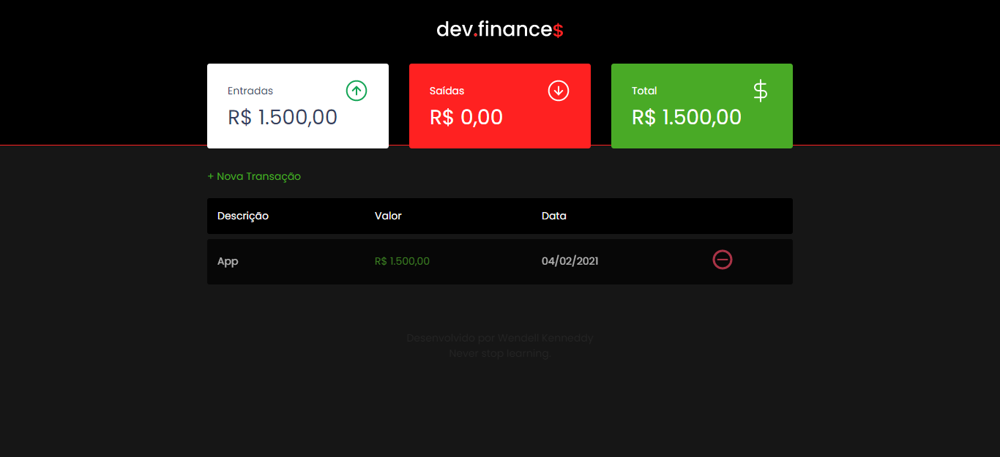
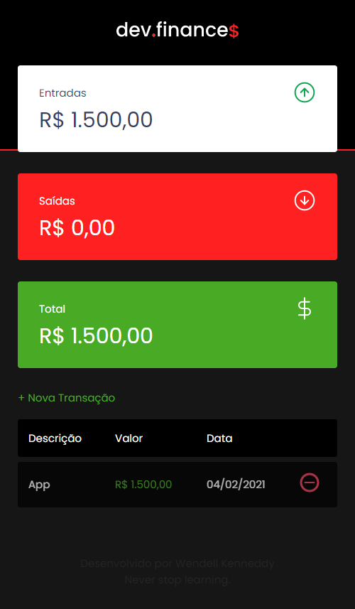

<h1>
  </img>
</h1>

<h4 align="center">Uma aplicação para te auxiliar a gerenciar seu balanço bancário. O projeto foi desenvolvido durante a Maratona Discover, disponibilizada gratuitamente pela Rocketseat.</h4>

</img>

---

## :bookmark_tabs: Tabela de Conteúdo
- [Tecnologias Utilizadas](#hammer-tecnologias-utilizadas)
- [Features](#sparkles-features)
    - [A ser adicionado](#calendar-a-ser-adicionado)
- [Seja um Contribuidor](#handshake-seja-um-contribuidor)
- [Screenshots da Aplicação](#camera-screenshots-da-aplicação)
- [Licença](#books-licença)

---

## :hammer: Tecnologias Utilizadas
Para desenvolver esta aplicação, utilizei as seguintes tecnologias: 
- HTML
- SCSS
- JavaScript

---

## :sparkles: Features
- Adicionar e remover transações, com valor, data e descrição
- Visualizar o balanço total 
- Responsividade

### :calendar: A ser adicionado
- [ ] Dark Mode

---

## :handshake: Seja um contribuidor
Tem alguma ideia que poderia alavancar ainda mais o projeto, e deseja implementar? É simples!
- Faça um fork do projeto
- Modifique o que achar necessário 
- Faça o commit das mudanças
- Crie um Pull Request

---

## :camera: Screenshots da aplicação
:computer:  Desktop:
</img>

:iphone: Mobile:
</img>

---

## :books: Licença
Este projeto está sob [licença MIT](https://choosealicense.com/licenses/mit/).
Clique no link acima ou veja o [LICENSE](./LICENSE) do projeto para mais detalhes.