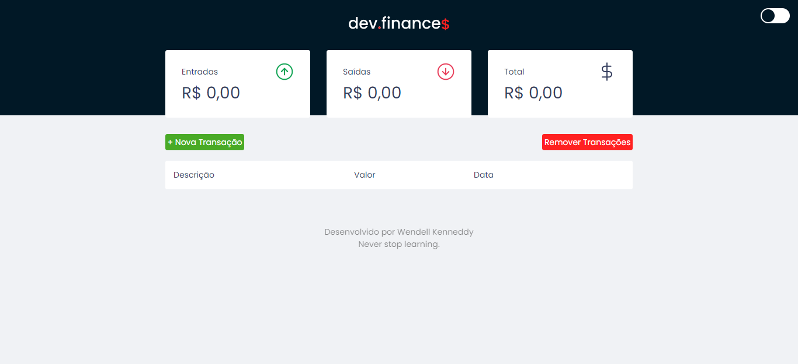

# 

---

## :bookmark_tabs: Tabela de Conteúdo

- [:closed_book: Sobre](#closed_book-sobre)
- [:hammer_and_pick: Tecnologias Utilizadas](#hammer_and_pick-tecnologias-utilizadas)
- [:sparkles: Features](#sparkles-features)
- [:heavy_check_mark: A ser adicionado](#heavy_check_mark-a-ser-adicionado)
- [:handshake: Seja um Contribuidor](#handshake-seja-um-contribuidor)

---

## :closed_book: Sobre

Dev.finances é uma aplicação que te ajuda a gerenciar seu balanço bancário.

Adicione transações de entrada e saída, e o valor de cada uma delas será exibido, bem como o balanço total entre elas.

---

## :hammer_and_pick: Tecnologias Utilizadas

Para desenvolver esta aplicação, utilizei as seguintes tecnologias:

- HTML
- SCSS
- JavaScript

---

## :sparkles: Features

- Adicionar e remover transações, com valor, data e descrição
- Editar transações
- Visualizar o balanço total
- Responsividade

---

## :heavy_check_mark: A ser adicionado

- [x] Dark Mode
- [x] Funcionalidade que altera a cor de fundo do card total de acordo com o valor, sendo vermelho para menor que 0 e verde para maior que 0.
- [x] Botão de apagar todas as transações

---

## :handshake: Seja um contribuidor

Tem alguma ideia que poderia alavancar ainda mais o projeto, e deseja implementar? É simples!

1. Faça um fork do projeto
2. Modifique o que achar necessário
3. Faça o commit das mudanças
4. Crie um Pull Request

---
